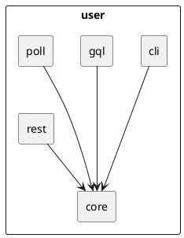

The [post on organizing backend code](posts/organizing-backend-code.html) covers the broad strokes of setting up the directory structure for a backend codebase. This post focuses on the leaf-node atomic module. For example, imagine a codebase with the following modules:

```
domain/
  platform/
    user/
    tenant/
```

How can we organize the internals of the leaf-node modules, i.e. user and tenant here?

## Directory structure

```sh
# Each module is conceptually like a
# microservice, exposing well-defined
# APIs to the rest of the system.
user/
  cli/
  core/
  gql/
  poll/
  rest/
```


### core/

The core business logic for the module, agnostic of the entry point. All other submodules within `user/` depend on this one.

```sh
user/
  core/
    dev/
      user.faker.ts
      user.seeder.ts
    dto/
      user.dto.ts
      user-revised.payload.dto.ts
    mutate/
      user.create.service.ts
      user.update.service.ts
    query/
      user.query.service.ts
    user.prisma
    user.module.ts
```

### cli/

Command-line interface.

```
user/
  cli/
    cli-create-user.ts
    cli-user.module.ts
```

### gql/

GraphQL types and resolvers.

```
user/
  gql/
    gql-user.type.ts
    gql-user.resolver.ts
    gql-user.module.ts
```

### poll/

Pollers, including event consumers.

```
user/
  poll/
    poll-user-tenant-revised/
      poll-user-tenant-revised.module.ts
```

### rest/

The REST API surface.

```
user/
  rest/
    rest-user.controller.ts
    rest-user.module.ts
```

## PlantUML source


