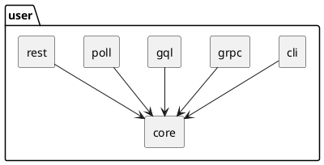

The [post on organizing backend code](/posts/organizing-backend-code.html) covers the broad strokes of setting up the directory structure for a backend codebase. This post focuses on "leaf nodes" in the module dependency hierarchy: atomic domain modules. For example, in a codebase with the following modules:

```
domain/
  platform/
    user/
    tenant/
```

The atomic domain modules are `user/` and `tenant/`.

## Domain encapsulation

An atomic domain module contains all code related to a given domain. It interacts with other modules through well-defined APIs. For inputs and outputs, scalars and data transfer objects (DTOs) rather than raw database records.

## Deployment

It's easiest to get up and running with all domain modules deployed as part of a monolith. But I like to design the system in such a way that it is _possible_ to peel off individual domain modules into separate services. Even if it's not necessary to break out into services, aiming for that possibility encourages modularity.

## Database interactions

The following should be avoided across modules:

- Transactions
- Joins during queries
- Foreign key constraints

There are some exceptions here, which we'll save for another post.

## Directory structure

```sh
user/
  cli/
  core/
  grpc/
  gql/
  poll/
  rest/
```

### Dependency hierarchy


### core/

The core business logic for the module, agnostic of the entry point. All other submodules within `user/` depend on this one.

```sh
user/
  core/

    # Fakers and seeders can be used to generate
    # and seed fake data in development.
    dev/
      user.faker.ts
      user.seeder.ts

    # Data transfer objects (DTOs) should be used
    # for cross-module interactions.
    dto/
      user.dto.ts
      user-revised.payload.dto.ts

    # Service classes for writing into the database.
    mutate/
      user.create.service.ts
      user.update.service.ts

    # Service classes for reading from the database.
    query/
      user.query.service.ts

    # Elasticsearch document definition and config.
    search/
      user.es-dto.ts
      user.es-reindexer.ts
      user.searchkit-config.ts

    # Database schema.
    user.prisma

    # The "core" business logic module for this domain.
    user.module.ts
```

### cli/

Command-line interface. This could include a runner file so that the CLI for this module loads only its immediate dependencies.

```
user/
  cli/
    cli-create-user.ts
    cli-user.module.ts
    user-cli.runner.ts
```

### gql/

GraphQL types and resolvers.

```
user/
  gql/
    gql-user.type.ts
    gql-user.resolver.ts
    gql-user.module.ts
```

### poll/

Pollers, including event consumers.

```
user/
  poll/
    poll-user-tenant-revised/
      poll-user-tenant-revised.module.ts
```

### rest/

The REST API surface.

```
user/
  rest/
    rest-user.controller.ts
    rest-user.module.ts
```

## PlantUML source


